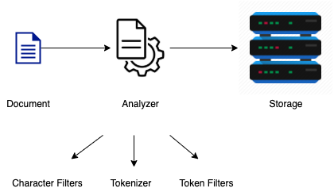

# Analysis



### Character filters

* Adds, removes or changes characters
* Analyzers contain zero or more character filters
* Character filters are applied in the order in which they are specified
* Example (`html strip` filter)
  - **Input: "**`I&apos;m in a <em>good</em> mood&nbsp;-&nbsp;and
    I <strong>love</strong> coffee!`**"**
  - **Output: "**I'm in a good mood - and I love coffee!**"**

### Tokenizers

* An analyzer contains **one** tokenizer
* Tokenizes a string, i.e. splits it into tokens
* Characters may be stripped part of tokenization
* Example
   - **Input: "**I REALLY like beer!**"**
   - **Output:** ["I", "REALLY", "like", "beer"]
* The tokenizer also records the character offsets for each token in the original string

### Token filters

* Receive the output of the tokenizer as input (i.e. the tokens)
* A token filter can add, remove, or modify tokens
* An analyzer contains zero or more token filters
* Token filters are applied in the order in which they are specified
* Example (`lowercase` filter)
   - **Input: "**I REALLY like beer!**"**
   - **Output:** ["i", "really", "like", "beer"]

### Built-in and custom components

* Built-in analyzers, character filters, tokenizers, and token filters are available
* We can also build custom ones

### Default working

#### Analyzer - standard
* Standard analyzer is the default analyzer of ES
* It is used for all `text` fields unless configured otherwise

#### Character Filters - none

**Input: "**I REALLY like beer!**"**</br>
**Output: "**I REALLY like beer!**"**

* No character filter is used by default
* So the text is passed to the tokenizer as it is

#### Tokenizer - standard

**Input: "**I REALLY like beer!**"**</br>
**Output:** ["I", "REALLY", "like", "beer"]

* The tokenizer splits the text into tokens according to the unicode segmentation algorithm
* Essentially it breaks sentences by whitespaces, hyphens etc
* In the process, it also throws away punctuations such as commas, periods, exclamation marks etc

#### Token filters - lowercase

**Input:** ["I", "REALLY", "like", "beer"]</br>
**Output:** ["i", "really", "like", "beer"]

* The tokenizer splits the text into tokens according to the unicode segmentation algorithm
* Essentially it breaks sentences by whitespaces, hyphens etc
* In the process, it also throws away punctuations such as commas, periods, exclamation marks etc

## Standard Analyzer (default)


Similarly

Request:

```json
POST _analyze
{
  "text": "2 guys walk into     a bar, but the third... DUCKS! :-)"
}
```

Response:

```json
{
  "tokens" : [
    {
      "token" : "2",
      "start_offset" : 0,
      "end_offset" : 1,
      "type" : "<NUM>",
      "position" : 0
    },
    {
      "token" : "guys",
      "start_offset" : 2,
      "end_offset" : 6,
      "type" : "<ALPHANUM>",
      "position" : 1
    },
    {
      "token" : "walk",
      "start_offset" : 7,
      "end_offset" : 11,
      "type" : "<ALPHANUM>",
      "position" : 2
    },
    {
      "token" : "into",
      "start_offset" : 12,
      "end_offset" : 16,
      "type" : "<ALPHANUM>",
      "position" : 3
    },
    {
      "token" : "a",
      "start_offset" : 21,
      "end_offset" : 22,
      "type" : "<ALPHANUM>",
      "position" : 4
    },
    {
      "token" : "bar",
      "start_offset" : 23,
      "end_offset" : 26,
      "type" : "<ALPHANUM>",
      "position" : 5
    },
    {
      "token" : "but",
      "start_offset" : 28,
      "end_offset" : 31,
      "type" : "<ALPHANUM>",
      "position" : 6
    },
    {
      "token" : "the",
      "start_offset" : 32,
      "end_offset" : 35,
      "type" : "<ALPHANUM>",
      "position" : 7
    },
    {
      "token" : "third",
      "start_offset" : 36,
      "end_offset" : 41,
      "type" : "<ALPHANUM>",
      "position" : 8
    },
    {
      "token" : "ducks",
      "start_offset" : 45,
      "end_offset" : 50,
      "type" : "<ALPHANUM>",
      "position" : 9
    }
  ]
}
```

Essentially all these queries are same:

1. ```json
   POST _analyze
   {
      "text": "2 guys walk into     a bar, but the third... DUCKS! :-)"
   }
   ```

2. ```json
   POST _analyze
   {
      "text": "2 guys walk into     a bar, but the third... DUCKS! :-)",
      "analyzer": "standard"
   }
   ```

3. ```json
   POST _analyze
   {
      "text": "2 guys walk into     a bar, but the third... DUCKS! :-)",
      "char_filter": [],
      "tokenizer": "standard",
      "filter": ["lowercase"]
   }
   ```
