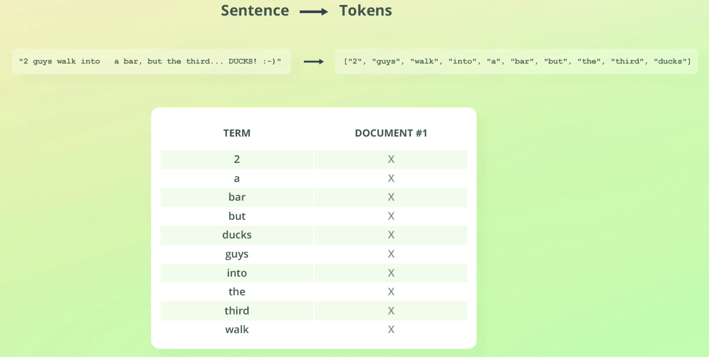
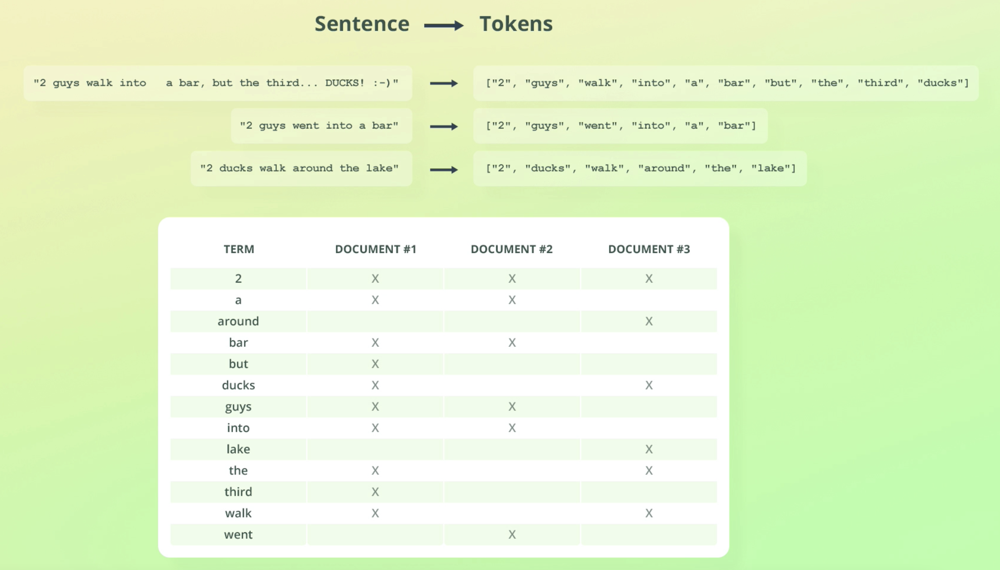
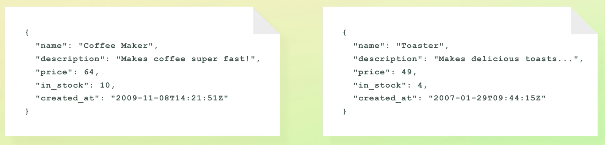

# Understanding Inverted Indices

* A field's values are stored in one of several data structures
  - The data structure depends on the field's data type
* The reason ES uses more than one type of data structure is to ensure efficient data retrieval for different access patterns.
  - For example - searching for a given term is handled differently than aggregating data
* Actually these data structures are handled by Apache Lucene and not ES
* Inverted Index is one of those data structures

## Inverted Indices

* Mapping between terms and which documents contain them
* Tokens are sorted alphabetically

> What makes an Inverted Index so powerful is how efficient it is to look up a term and find the documents in which the term appears.

Figuring out which documents contain that term is just a matter of performing a single look up in the inverted index.

The reason the index is called as an "Inverted Index" is just that the more logical mapping would be to have a mapping from documents to the terms they contain. This doesn't provide fast look-ups.

So that's why the relationship is **inverted**.

* Inverted indices contain more than just terms and document IDs
  - such as data that is used for relevance scoring

Till now we were indexing a simple sentence in the same field ("text")

What happens if we index documents containing a number of different fields.

**Are all the values stored within the same Inverted Index?**

An Inverted Index is actually created for **each text field** meaning we will have 2 inverted indices created for this example:

1. For the name field
2. For the description field

