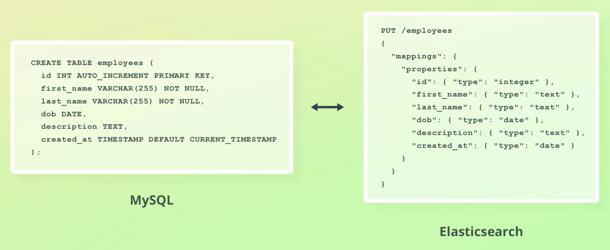

# Mapping

* Defines the structure of documents (e.g. fields and their data types)
  - Also used to configured how values are indexed

* Similar to a table's schema in a relational database

There are 2 types of mapping:

1. Explicit mapping
  - We define the field mappings ourselves

2. Dynamic mapping
  - ES generates fields mappings for us
